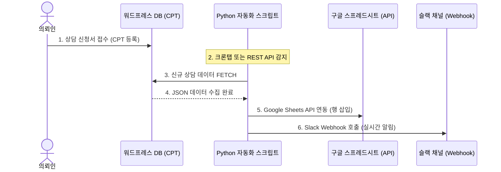

# 🐍 Python 업무 자동화 및 데이터 처리 작업계획서

본 계획서는 **법무법인 파라딘(PARADIN)** 포트폴리오의 실무 우대 역량을 극대화하기 위해, 워드프레스 상담 데이터와 내부 업무 시스템(**구글 스프레드시트**, **사내 슬랙 메신저**)을 연동하는 **Python 자동화 시스템** 설계 문서입니다.

---

## 1. 시스템 설계 및 아키텍처 (Architecture)

의뢰인이 웹사이트에서 상담 신청서를 접수하면, 데이터가 워드프레스 DB를 거쳐 실시간 또는 배치 방식으로 구글 스프레드시트와 슬랙으로 동기화되는 흐름입니다.



---

## 2. 세부 기능 및 모듈 구성 (Module Details)

### ① Google Sheets API 실시간 동기화
* **개요:** 행정 직원이나 대표 변호사가 익숙한 엑셀(구글 시트) 환경에서 실시간 상담 예약 현황을 체크할 수 있도록 돕습니다.
* **사용 라이브러리:** `gspread`, `google-auth`
* **동작:**
  1. 구글 클라우드 콘솔에서 서비스 계정(Service Account)을 생성하여 인증 키(JSON) 발급.
  2. 스크립트 실행 시 인증을 거쳐 사전에 지정한 스프레드시트의 특정 탭(Sheet)을 로드.
  3. 워드프레스의 신규 상담자 정보(이름, 연락처, 부채액, 지역, 상황 메시지, 일시)를 `append_row()`를 통해 가장 아래 행에 즉시 추가.

### ② Slack Webhook 실시간 긴급 알리미
* **개요:** 상담 신청 접수 후 30분 이내에 긴급 전화를 돌릴 수 있도록, 담당 변호사단 슬랙 채널에 카드 포맷의 실시간 Push 알림을 전송합니다.
* **사용 라이브러리:** `requests` (Slack Incoming Webhook URL 사용)
* **동작:**
  1. 슬랙 워크스페이스에 Incoming Webhooks 앱을 추가하여 고유 Webhook URL을 발급받습니다.
  2. 상담 정보를 이쁘게 구조화하여 슬랙의 Block Kit 포맷으로 변환한 뒤 POST 요청으로 전송합니다.

---

## 3. 코드베이스 구현 설계 (Code Structure)

저장소 루트에 `automation/` 폴더를 새로 개설하고 다음 파일들을 배치합니다.

```bash
wordpress-dev/
├── docs/
│   └── python-automation-plan.md     # 본 작업 계획서
└── automation/
    ├── .env.example                  # 환경변수 템플릿 (인증 정보 은닉용)
    ├── credentials.json.example      # 구글 서비스 계정 인증서 키 예시 파일
    ├── requirements.txt              # 파이썬 의존성 패키지 목록
    └── sync_consultation.py          # 자동화 및 동기화 메인 스크립트
```

### 📄 .env 설정 제안 (`automation/.env.example`)
```env
# WordPress API 설정
WP_SITE_URL=http://localhost:8088
WP_API_USER=admin
WP_API_PASSWORD=xxxx xxxx xxxx xxxx

# Google Sheets 설정
GOOGLE_SHEET_TITLE="법무법인 파라딘 상담 현황"
GOOGLE_SHEET_TAB_NAME="실시간신청"

# Slack Webhook 설정
SLACK_WEBHOOK_URL=https://hooks.slack.com/services/XXXX/YYYY/ZZZZ
```

### 📄 파이썬 의존성 패키지 (`automation/requirements.txt`)
```text
requests==2.31.0
gspread==5.10.0
google-auth==2.22.0
python-dotenv==1.0.0
```

---

## 4. 배포 및 실행 가이드 (Deployment & Execution Guide)

작성된 파이썬 스크립트를 실제로 실행하고 배포하는 방법은 크게 세 가지로 분류됩니다.

### ① 로컬 개발 환경 수동 실행 (Local Manual Run)
가장 빠르게 스크립트의 정상 동작을 검증하는 방법입니다.
1. 파이썬 가상환경 생성 및 활성화:
   ```bash
   python -m venv venv
   # Windows
   .\venv\Scripts\activate
   # Mac/Linux
   source venv/bin/activate
   ```
2. 의존성 패키지 설치:
   ```bash
   pip install -r requirements.txt
   ```
3. 동기화 스크립트 실행:
   ```bash
   python sync_consultation.py
   ```

### ② 서버 환경 주기적 실행 (Cron Job & Task Scheduler)
상담 데이터를 일정 시간 주기(예: 5분 또는 10분 간격)로 긁어와 동기화하기 위한 가장 정석적인 배포 방법입니다.

* **Linux / WSL (cron 서비스 활용):**
  크론탭 설정을 열고 5분마다 스크립트가 돌아가도록 설정합니다.
  ```bash
  crontab -e
  # 매 5분마다 파이썬 스크립트 자동 실행 및 로그 기록 설정 예시
  */5 * * * * /path/to/automation/venv/bin/python /path/to/automation/sync_consultation.py >> /path/to/automation/sync.log 2>&1
  ```
* **Windows (작업 스케줄러 활용):**
  '작업 스케줄러' 앱에서 새 작업을 만들고, 5분 주기로 트리거하여 `venv\Scripts\python.exe`를 시작 프로그램으로 지정하고 인수로 `sync_consultation.py`의 절대경로를 설정합니다.

### ③ 실무 클라우드 배포 시나리오 (Cloud Deployment)
실무 로펌의 프로덕션 환경에서는 24시간 가동되는 서버 비용을 아끼기 위해 **서버리스(Serverless)**로 배포하는 것이 모범 사례(Best Practice)입니다.

* **AWS Lambda + EventBridge (Cron):**
  * 파이썬 스크립트를 AWS Lambda 함수로 업로드하고, **Amazon EventBridge**를 사용하여 5분 혹은 10분 간격으로 함수가 트리거되도록 설정합니다.
  * 서버를 상시 구동할 필요가 없어 **월 비용이 0원**에 수렴하며 안정적인 운용이 가능합니다.
* **AWS EC2 / 가벼운 VPS (Ubuntu):**
  * 가상 서버 인스턴스를 대여하고, 그 안에서 가상환경(`venv`)을 활성화한 뒤 위 Linux Cron 설정을 적용해 가동합니다.

---

## 5. 향후 작업 진행 단계 (Next Steps)

1. **폴더 및 의존성 구성:** `automation/` 폴더를 생성하고 패키지 요구사항 파일을 작성합니다.
2. **구현 코드 코딩:** 동적 REST API 조회 기능, 구글 시트 연동 모듈, 슬랙 알림 발송 로직이 유기적으로 합쳐진 `sync_consultation.py` 파이썬 코드를 작성합니다.
3. **환경변수 견본 제공:** 키값들이 유출되지 않도록 `.env.example` 및 `.gitignore`를 업데이트하여 안전하게 프로젝트를 보안합니다.
4. **README.md 연동 업데이트:** 본 파이썬 스크립트 실행 방법과 구조에 대한 설명을 `README.md` 마지막 부분에 추가합니다.

---

> [!IMPORTANT]  
> 이 작업계획은 채용 담당자에게 PHP 백엔드 웹 서비스뿐만 아니라 **파이썬 데이터 파이프라인 및 타사 서비스 API 통합 자동화 역량**까지 한 번에 보여줄 수 있는 좋은 마일스톤입니다. 작업 진행 승인을 해주시면 실제 작동 가능한 파이썬 코드를 한 땀 한 땀 장인 정신으로 빌드하겠습니다.

