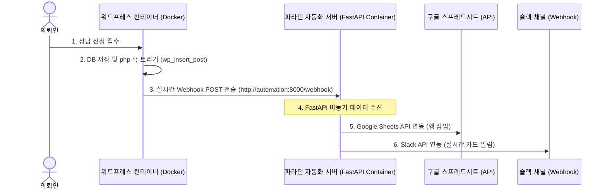

# 🐍 Python 업무 자동화 및 데이터 처리 작업계획서 (Docker & Webhook 기반 실시간 연동)

본 계획서는 **법무법인 파라딘(PARADIN)** 포트폴리오의 실무 및 DevOps 역량을 극대화하기 위해, 맥미니의 도커(Docker Compose) 환경 하에서 워드프레스와 파이썬 웹 서버(**FastAPI**)를 하나의 네트워크로 묶어 실시간 상담 데이터(**구글 스프레드시트**, **사내 슬랙**)를 자동 분산 처리하는 시스템 설계 문서입니다.

---

## 1. 실시간 웹훅 아키텍처 (Real-time Webhook Architecture)

의뢰인이 웹사이트에서 상담 신청서를 접수하면, 워드프레스가 DB에 저장하는 즉시 **PHP `wp_insert_post` 훅**을 트리거하여 도커 내부 네트워크의 파이썬 FastAPI 서버로 실시간 POST 요청을 던집니다.



---

## 2. 세부 기능 및 모듈 구성 (Module Details)

### ① 워드프레스 웹훅 발송기 (WordPress PHP Webhook Sender)
* **위치:** `functions.php` 하단
* **역할:** 상담 CPT(`consultation`)가 생성되면, 해당 메타 데이터를 모아 파이썬 컨테이너로 JSON POST 요청을 보냅니다.
* **통신 경로:** 도커 내부 DNS를 사용하므로, localhost IP 대신 컨테이너 서비스 이름(`http://automation:8000/webhook`)으로 직결 통신합니다.

### ② 파이썬 FastAPI 비동기 수신서버 (Python FastAPI Web Server)
* **위치:** `automation/main.py`
* **역할:** 워드프레스의 웹훅 POST 요청을 비동기 수신(`async def create_webhook`)하여, 구글 시트 쓰기 작업 및 슬랙 발송 작업을 백그라운드 태스크로 넘겨 처리 속도와 안정성을 확보합니다.

### ③ Google Sheets API 실시간 동기화
* **사용 라이브러리:** `gspread`, `google-auth`
* **동작:** 전달받은 상담 데이터를 구글 클라우드 콘솔의 서비스 계정 키를 통해 구글 드라이브 상의 실시간 스프레드시트에 안전하게 누적 기록합니다.

### ④ Slack Webhook 실시간 카드 알리미
* **사용 라이브러리:** `requests` 또는 `slack_sdk`
* **동작:** 슬랙의 Incoming Webhook URL을 활용하여, 긴급 상담 정보를 카드 레이아웃으로 변환해 로펌 비서팀/변호사 채널에 즉시 푸시합니다.

---

## 3. Docker Compose 통합 설계 (Multi-Container DevOps Design)

기존의 워드프레스 및 MySQL 컨테이너가 돌고 있는 `docker-compose.yml` 파일에 파이썬 서버 서비스를 아래와 같이 완벽히 통합합니다.

### 📄 `docker-compose.yml` 서비스 정의 추가안
```yaml
version: '3.8'

services:
  # ... 기존 wordpress, db 서비스 영역 생략 ...

  # 🆕 파이썬 실시간 자동화 컨테이너 추가
  automation:
    build:
      context: ./automation
      dockerfile: Dockerfile
    container_name: paradin-automation
    restart: always
    ports:
      - "8000:8000"
    volumes:
      - ./automation:/app
      - /app/venv # 볼륨 마운트 시 가상환경 폴더 공유 예외 처리
    env_file:
      - ./automation/.env
    networks:
      - wp-network # 기존 wordpress 컨테이너와 동일한 네트워크 설정

networks:
  wp-network:
    driver: bridge
```

---

## 4. 코드베이스 디렉토리 구조 (Directory Structure)

```bash
wordpress-dev/
├── docker-compose.yml                # automation 서비스가 추가될 도커 컴포즈 파일
├── docs/
│   └── python-automation-plan.md     # 본 작업 계획서
└── automation/
    ├── .env.example                  # 환경변수 설정 가이드템플릿
    ├── credentials.json.example      # 구글 API 인증키 정보 예시
    ├── requirements.txt              # FastAPI 및 gspread 등 패키지 목록
    ├── Dockerfile                    # 파이썬 컨테이너 빌드 파일
    └── main.py                       # FastAPI 및 자동화 핵심 비동기 앱 코드
```

### 📄 파이썬 컨테이너 구성 정의 (`automation/Dockerfile`)
```dockerfile
FROM python:3.10-slim

# 🆕 Astral의 초고속 패키지 매니저 uv 바이너리 추가
COPY --from=ghcr.io/astral-sh/uv:latest /uv /uvx /bin/

WORKDIR /app

# uv를 사용하여 시스템 패키지 형태로 비동기 초고속 빌드 진행
COPY requirements.txt .
RUN uv pip install --no-cache --system -r requirements.txt

COPY . .

EXPOSE 8000

CMD ["uvicorn", "main:app", "--host", "0.0.0.0", "--port", "8000", "--reload"]
```

### 📄 파이썬 의존성 패키지 (`automation/requirements.txt`)
```text
fastapi==0.100.0
uvicorn==0.22.0
requests==2.31.0
gspread==5.10.0
google-auth==2.22.0
python-dotenv==1.0.0
```

---

## 5. 실행 및 배포 프로세스 (Execution & Deployment)

도커 빌드 메커니즘을 사용하므로, 배포가 다음 명령어 한 줄로 마무리됩니다.

1. **도커 이미지 빌드 및 백그라운드 구동:**
   ```bash
   docker compose up -d --build
   ```
   * *참고:* 빌드 시 `uv` 패키지 캐싱이 작동하여 이미지 빌드 속도가 기존 `pip` 대비 최대 10배 이상 단축됩니다.
2. **정상 구동 여부 확인 (로그 검증):**
   ```bash
   docker compose logs -f automation
   ```
   * uvicorn 서버가 `http://0.0.0.0:8000`에서 요청을 정상 대기하고 있는지 로그를 통해 파악합니다.

### 💡 (옵션) 로컬 개발 환경에서 uv 수동 실행 가이드
만약 도커 컨테이너를 쓰지 않고 로컬 맥미니 환경에서 직접 파이썬 서버를 실행할 때는 다음 `uv` 명령어를 활용합니다.
1. `uv` 설치 (설치되어 있지 않은 경우):
   ```bash
   # MacOS / Linux
   curl -LsSf https://astral.sh/uv/install.sh | sh
   ```
2. 가상환경 생성 (`venv` 대신 `uv` 가상환경 개설):
   ```bash
   uv venv
   # 가상환경 활성화 (MacOS)
   source .venv/bin/activate
   ```
3. 초고속 패키지 인스톨:
   ```bash
   uv pip install -r requirements.txt
   ```
4. FastAPI 서버 구동:
   ```bash
   uvicorn main:app --reload
   ```

---

## 6. 향후 작업 진행 단계 (Next Steps)

1. **도커 컴포즈 업데이트:** `docker-compose.yml` 파일에 `automation` 구문을 안전하게 주입합니다.
2. **파이썬 모듈 코드베이스 작성:** `automation/` 디렉토리를 생성하고 `Dockerfile`, `main.py`, `requirements.txt`, `.env.example`을 작성합니다.
3. **워드프레스 웹훅 이식:** `functions.php`에 상담 글 저장 이벤트 시 `wp_remote_post()` 함수를 써서 `http://automation:8000/webhook`으로 JSON을 전송하는 PHP 후킹 코드를 작성합니다.
4. **최종 통합 테스트 및 README.md 보완:** 도커 컴포즈 실행법 및 `uv` 사용 매뉴얼을 README에 명시하여 마무리합니다.

