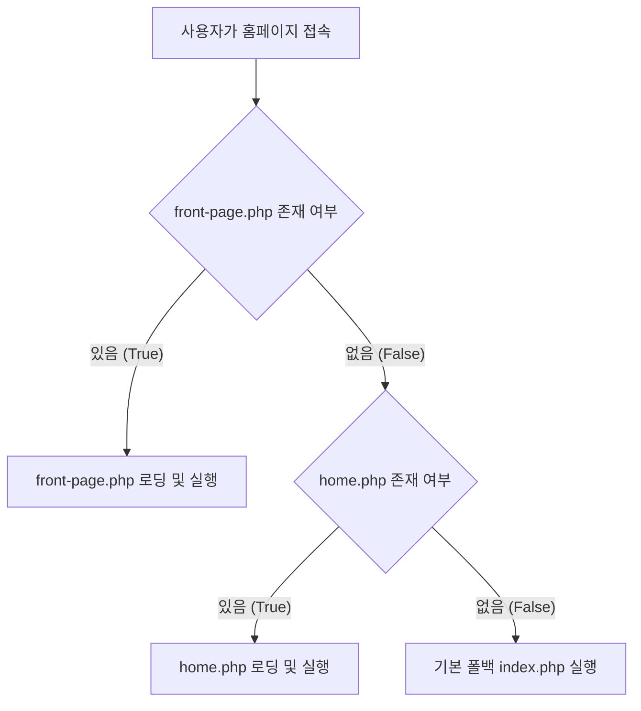

# 워드프레스 커스텀 테마 적용 원리 및 메커니즘

새롭게 제작한 `iel-theme`가 어떻게 워드프레스에 인식되고, 데이터베이스 수준에서 활성화되어 브라우저에 렌더링되는지에 대한 동작 원리를 정리한 가이드 문서입니다.

---

## 1. 워드프레스는 테마를 어떻게 인식하는가?

워드프레스 엔진은 작동할 때 `wp-content/themes/` 디렉토리를 자동으로 스캔합니다. 이때 아래의 두 가지 핵심 규칙을 기준으로 테마의 유효성을 판단합니다.

1. **테마 선언 메타데이터 (`style.css`)**:
   - 워드프레스는 테마 디렉토리 안의 `style.css` 파일의 최상단 주석을 읽어서 테마의 정보(이름, 버젼, 제작자 등)를 인식합니다.
   - 예시:
     ```css
     /*
     Theme Name: IEL Theme
     ...
     */
     ```
2. **필수 템플릿 파일 존재 여부 (`index.php`)**:
   - 워드프레스는 테마가 최소한 작동할 수 있는 백업 파일로 `index.php`가 존재하는지 검사합니다. 이 파일이 없으면 테마 목록에 "손상된 테마"로 표시됩니다.

---

## 2. 테마는 데이터베이스에서 어떻게 활성화되는가?

일반적으로는 워드프레스 관리자 페이지(`wp-admin`)에서 마우스 클릭으로 테마를 활성화하지만, 내부적으로는 **데이터베이스(DB)의 설정값을 수정하는 것**과 정확히 같습니다.

우리가 데이터베이스 컨테이너(`wordpress-db-1`)에서 실행했던 SQL 쿼리는 다음과 같습니다.
```sql
UPDATE wp_options 
SET option_value = 'iel-theme' 
WHERE option_name IN ('template', 'stylesheet');
```

* **`template` 옵션**: 부모 테마의 폴더명을 결정합니다 (여기서는 `iel-theme`).
* **`stylesheet` 옵션**: 현재 활성화된 하위/자식 테마(또는 단독 테마)의 폴더명을 결정합니다 (여기서는 `iel-theme`).

워드프레스 엔진은 사용자의 요청(예: `http://localhost:8080/` 접속)을 받으면, 먼저 DB에서 이 두 설정을 조회하여 어떤 폴더 내의 PHP 파일들을 실행할지 결정하게 됩니다.

---

## 3. 웹서버 접속 시 어떤 파일이 우선 호출되는가?

워드프레스는 미리 정의된 **템플릿 계층 구조 (Template Hierarchy)**를 따릅니다. 메인 페이지(홈) 접속 시 파일 호출 우선순위는 다음과 같습니다:



우리가 `front-page.php`를 작성해 두었기 때문에, 워드프레스는 다른 파일들보다 이 파일을 가장 우선적으로 읽어들여 메인 화면으로 보여주게 된 것입니다.

---

## 4. 스타일, 스크립트 및 외부 라이브러리 연동 방식

우리가 제작한 테마가 어떻게 Tailwind CSS와 AOS 스크롤 효과를 연동하는지 그 흐름은 다음과 같습니다.

1. **`functions.php`의 인큐(Enqueue) 처리**:
   - 워드프레스 표준 방식에 따라 `wp_enqueue_script`와 `wp_enqueue_style` 함수를 이용하여 폰트, Tailwind 스크립트, AOS 모듈을 대기열에 등록합니다.
2. **`header.php`의 `wp_head()` 훅**:
   - `header.php` 문서 내의 `<?php wp_head(); ?>`가 실행될 때, `functions.php`에서 등록했던 모든 CSS 및 Tailwind 스크립트 태그가 `<head>` 영역 안으로 자동 삽입됩니다.
3. **`footer.php`의 `wp_footer()` 훅**:
   - `footer.php` 문서 내의 `<?php wp_footer(); ?>`가 실행될 때, AOS 애니메이션을 동작하게 해줄 자바스크립트 소스들이 `</body>` 태그 바로 직전에 삽입되어, 로딩 속도를 최적화하고 애니메이션을 부드럽게 초기화합니다.

---

## 5. 다크 모드 (Dark Mode) 테마 시스템 설계

법률 사이트의 엄숙하고 신뢰감 있는 느낌을 극대화하기 위해 바닐라 JS와 Tailwind CSS를 활용한 다크 모드 전환 시스템을 구축했습니다. 이때 해결한 핵심 기술적 챌린지는 다음과 같습니다.

### 5.1 FOUC(Flash of Unstyled Content) 현상 해결
웹페이지가 처음 로드될 때 브라우저가 라이트 모드를 먼저 그린 후 자바스크립트가 실행되면서 다크 모드로 전환되면 화면이 하얗게 깜빡이는 **FOUC(Flicker) 현상**이 발생합니다.
이를 방지하기 위해 `wp_head()`가 실행되고 본문(body)이 렌더링되기 전에, `<head>` 안에서 즉시 실행 함수(IIFE)를 실행하여 `localStorage`에 저장된 테마 값을 판별하고 `<html>` 태그에 `dark` 클래스를 즉시 주입하도록 설계했습니다.
```html
<script>
    (function() {
        var theme = localStorage.getItem('theme');
        if (theme === 'dark' || (!theme && window.matchMedia('(prefers-color-scheme: dark)').matches)) {
            document.documentElement.classList.add('dark');
        } else {
            document.documentElement.classList.remove('dark');
        }
    })();
</script>
```

### 5.2 CSS Cascading 기반 전역 다크 모드 오버라이딩
모든 페이지의 수많은 컴포넌트 클래스를 수동으로 변경하는 리스크를 줄이기 위해, Tailwind의 `darkMode: 'class'` 스펙과 CSS 우선순위(Specificity) 규칙을 적극적으로 활용했습니다. 
`style.css`에 글로벌 다크 모드 전용 선택자(`html.dark .bg-white` 등)를 명문화하고 `!important`를 통해 기존 Tailwind CDN의 기본 유틸리티 색상을 오버라이딩하도록 설계하여 코드 안전성과 유지보수성을 모두 향상시켰습니다.

---

## 6. 성능 및 미디어 최적화 파이프라인

로펌 사이트 특성상 변호사 소개, 시설 안내 등 고해상도 이미지가 필수적입니다. 이로 인한 웹 성능 저하를 방지하기 위해 브라우저와 서버 두 영역에서 최적화를 이뤄냈습니다.

### 6.1 브라우저 수준의 지연 로딩 (Lazy Loading)
스크롤 뷰포트 바깥에 배치되어 즉각적인 로딩이 필요하지 않은 모든 `` 태그에 HTML5 표준 속성인 `loading="lazy"`를 전수 부여했습니다. 이로 인해 초기 브라우저 로딩 리소스 요청 수가 줄어들며 First Contentful Paint (FCP) 점수를 대폭 개선했습니다.

### 6.2 서버 수준의 WebP 자동 변환 필터 파이프라인
일반 관리자나 사용자가 무거운 원본 이미지(JPEG, PNG)를 워드프레스 미디어 라이브러리에 업로드하더라도, 서버 스토리지 및 네트워크 전송 크기를 압축하기 위해 `functions.php`에서 `wp_handle_upload` 필터를 가로채서 이미지를 가공하도록 훅을 구현했습니다.

```php
// JPEG/PNG가 업로드되면 PHP GD 기능을 가동하여 82% 퀄리티의 WebP로 실시간 변환 후 원본을 파기함
add_filter('wp_handle_upload', 'iel_convert_upload_to_webp');
```
이 서버 파이프라인을 통해:
1. **스토리지 절약**: 고화질 JPG 이미지 용량을 원본 대비 최대 70~80% 절감
2. **트래픽 비용 감소**: 모바일 사용자의 데이터 대역폭 최적화
3. **Lighthouse 최적화**: 구글 검색 랭킹 요소 중 하나인 '차세대 이미지 제공' 기준을 완벽 통과하여 기술 완성도를 입증했습니다.

